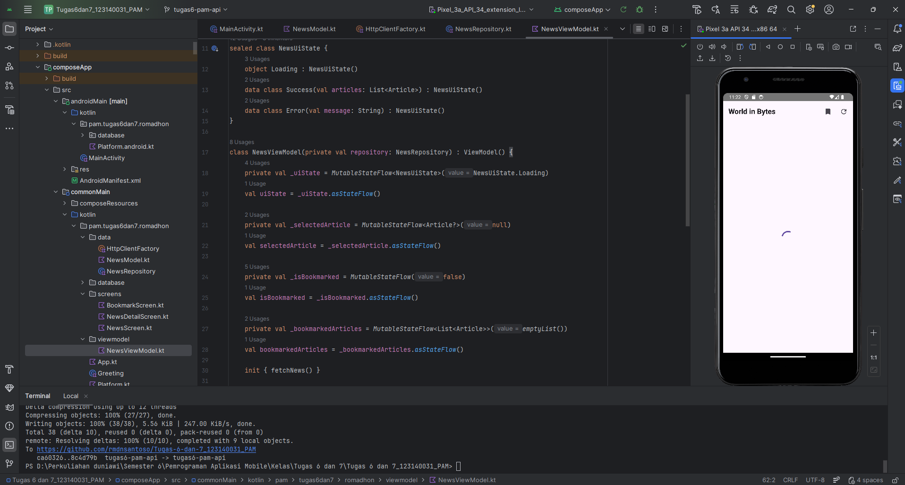
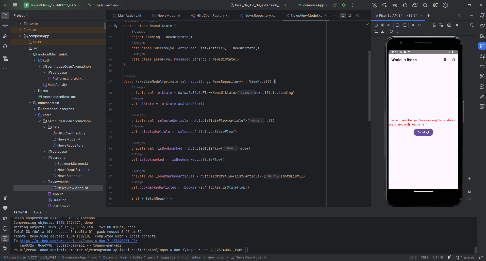

# Tugas 6 Networking dan REST API (Aplikasi Portal Berita) - Pemrograman Aplikasi Mobile
***

>Muhammad Romadhon Santoso 
>
>123140031 
> 
>Pemrograman Aplikasi Mobile RB

***
World in Bytes - Portal Berita Teknologi

Aplikasi World in Bytes ini dibuat untuk menampilkan berita teknologi terbaru secara real-time dengan mengambil data langsung dari internet. Di dalam aplikasi ini, pengguna bisa melihat berita utama yang ditampilkan secara mencolok serta daftar berita lainnya yang disusun secara rapi. Pengguna juga dapat mengeklik setiap berita untuk membaca detail informasinya secara lengkap dan menggunakan fitur pembaruan data untuk memastikan informasi yang dibaca selalu yang paling baru.

## Fitur Utama Terimplementasi
* **REST API Networking:** Menggunakan Ktor Client dan Kotlinx Serialization untuk menarik data dari `newsapi.org`.
* **State Management:** Memanfaatkan `StateFlow` untuk mengatur kondisi *Loading*, *Success*, dan *Error*.
* **Image Loading:** Menggunakan library `Kamel` untuk merender gambar dari URL secara asinkron.
* **Custom Layouting:** Implementasi "Hero Layout" untuk berita utama dan list artikel horizontal.
* **Navigation:** Transisi mulus dari layar daftar berita menuju layar detail artikel menggunakan parameter ID/Objek.
* **Pull-to-Refresh:** Fungsi pembaruan data secara manual oleh pengguna.

## API yang Digunakan
Aplikasi World in Bytes ini menggunakan public API dari **NewsAPI** untuk mendapatkan data berita terbaru secara *real-time*.

* **Nama API:** NewsAPI
* **Website:** [https://newsapi.org](https://newsapi.org)
* **Endpoint yang digunakan:** `/v2/top-headlines` (Kategori: Technology, Negara: US)

## Dokumentasi Antarmuka

Berikut adalah tampilan antarmuka aplikasi saat berhasil menarik data dari internet:

## Video Demo Aplikasi

