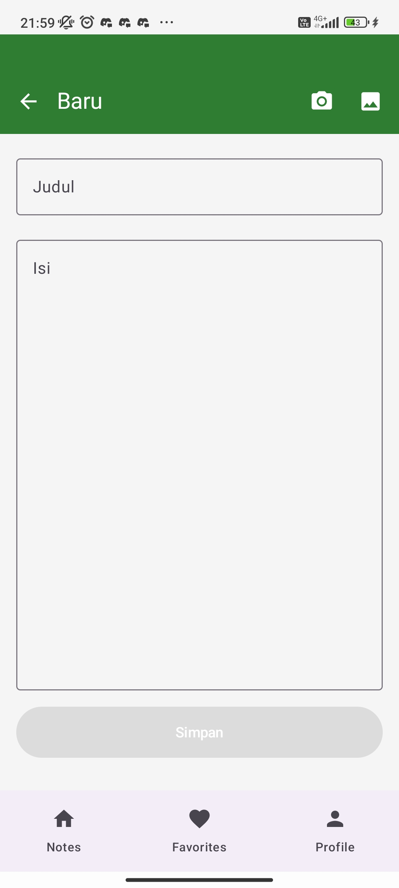

# Tugas 9 Pemrograman Aplikasi Mobile: Integrasi AI API

**Nama:** Muhammad Romadhon Santoso  
**NIM:** 123140031  
**Kelas:** Pemrograman Aplikasi Mobile RB

---

## 📌 Deskripsi Proyek
Proyek ini merupakan pengembangan lanjutan dari aplikasi Catatan (Notes App) berbasis Kotlin Multiplatform (KMP) yang telah dibangun pada tugas-tugas sebelumnya. Jika pada versi sebelumnya aplikasi ini sudah memiliki fitur CRUD (*Create, Read, Update, Delete*), sinkronisasi lokal, pengelolaan tema, dan favorit, pada **Tugas 9** ini aplikasi mendapat pembaruan besar berupa **Integrasi Kecerdasan Buatan (AI)**.

**Pembaruan Utama pada Versi Ini:**
1. **Penambahan Native Image Picker & Camera Launcher:** Pengguna kini bisa melampirkan gambar secara langsung dengan memotret lewat kamera HP atau memilih dari galeri.
2. **Fitur "Scan to Note" (AI):** Gambar yang dipilih akan dikirim ke AI untuk dianalisis, diekstrak, dan dirangkum secara otomatis menjadi sebuah catatan baru yang terdiri dari Judul dan Isi.

### 📸 Tampilan Fitur Baru (Kamera & Galeri)

> **Keterangan:** Tampilan halaman pembuatan catatan baru yang kini dilengkapi tombol *Camera* dan *Gallery* di pojok kanan atas, serta indikator *loading* saat AI sedang memproses teks.

---

