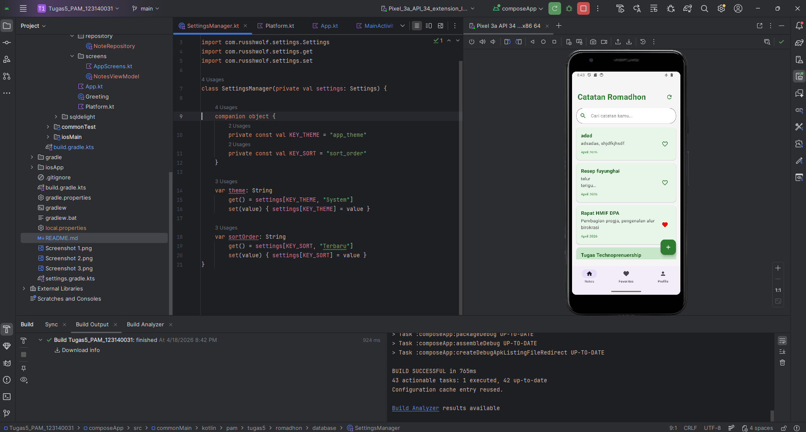
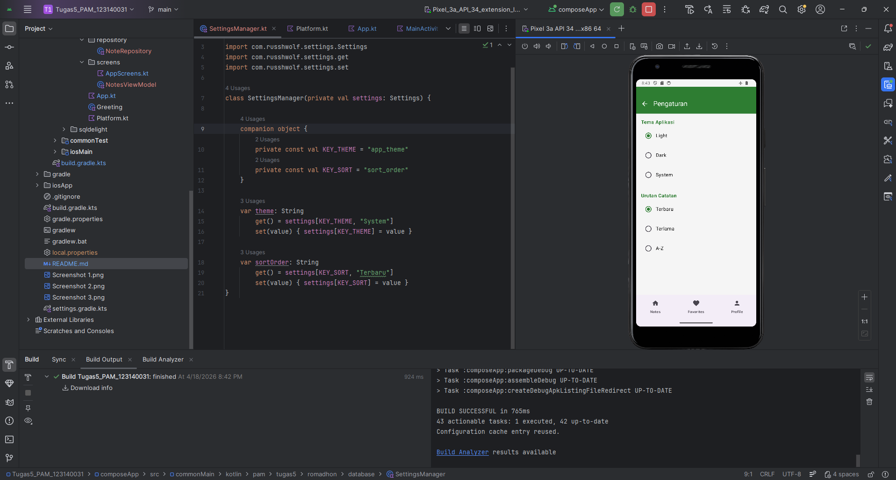
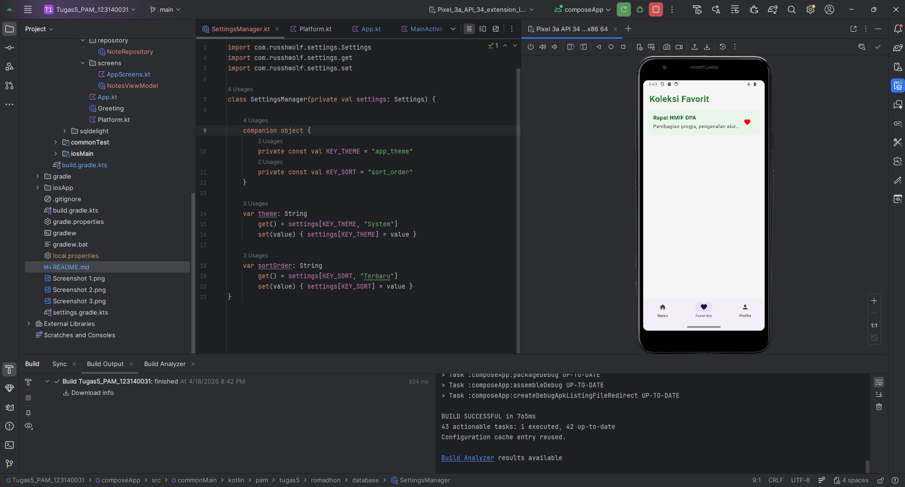
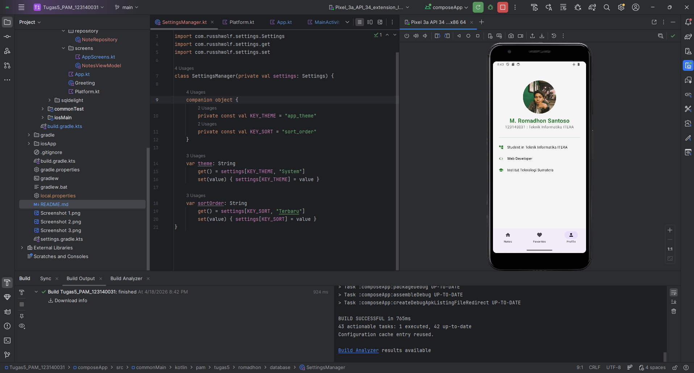

# 📝 Catatan Romadhon - Notes App - Tugas 7 Pemrograman Aplikasi Mobile

Proyek ini adalah aplikasi catatan (Notes App) berbasis **Kotlin Multiplatform (KMP)** yang mengimplementasikan arsitektur *Offline-First*. Aplikasi ini dibangun untuk memenuhi kriteria evaluasi **Tugas 7 - Pemrograman Aplikasi Mobile**.

## 👨‍💻 Dibuat oleh
* **Nama:** Muhammad Romadhon Santoso
* **NIM:** 123140031
* **Kelas:** RB

---

## ✨ Fitur Utama
✅ **1. Local Database & CRUD Operations (SQLDelight)**
* Menyimpan catatan secara permanen menggunakan SQLite lokal.
* Operasi lengkap: **Create** (tambah catatan), **Read** (tampil & detail), **Update** (edit teks), dan **Delete** (hapus data).
* Menandai catatan sebagai Favorit (`is_favorite`).

✅ **2. Fitur Pencarian Real-Time (Search)**
* Mencari catatan berdasarkan kata kunci secara langsung (*real-time*) berkat implementasi `StateFlow`.

✅ **3. Pengaturan Preferensi (DataStore / Multiplatform Settings)**
* **Tema Dinamis:** Mengubah tema aplikasi antara *Light*, *Dark*, dan *System Default* tanpa perlu *restart* aplikasi (Terintegrasi dengan Material 3 Color Scheme).
* **Sorting:** Mengubah urutan daftar catatan (Terbaru, Terlama, atau A-Z).

🚀 **4. BONUS: Sinkronisasi Remote API (Ktor Client)**
* Mengambil data teks JSON dari API publik (`jsonplaceholder`) secara *asynchronous*.
* Data yang di-*fetch* akan di-*parsing* dan langsung disuntikkan ke dalam *database* SQLite lokal.

🛡️ **5. Arsitektur Offline-First**
* Seluruh data disimpan secara lokal. Apabila pengguna menekan tombol *Sync API* saat tidak ada koneksi internet, aplikasi akan menangkap *exception* dengan aman dan tetap berfungsi normal 100% tanpa *Force Close*.

---

## 🛠️ Tech Stack & Library

* **Framework:** Kotlin Multiplatform (KMP) & Compose Multiplatform
* **UI Toolkit:** Jetpack Compose (Material 3)
* **Local Database:** SQLDelight (`app.cash.sqldelight:android-driver:2.0.1`)
* **Preferences/DataStore:** Multiplatform Settings (`com.russhwolf:multiplatform-settings:1.1.1`)
* **Network/API Client:** Ktor (`io.ktor:ktor-client-android:2.3.11`)
* **Navigation:** Jetpack Navigation Compose

---


## 🗄️ Skema Database (SQLDelight)

Berikut adalah struktur tabel `NoteEntity` yang digunakan di dalam file `Note.sq`:

```sql
CREATE TABLE NoteEntity (
    id INTEGER NOT NULL PRIMARY KEY AUTOINCREMENT,
    title TEXT NOT NULL,
    content TEXT NOT NULL,
    date TEXT NOT NULL,
    color INTEGER NOT NULL,
    is_favorite INTEGER NOT NULL DEFAULT 0
);

-- Queries
insertNote:
INSERT INTO NoteEntity(title, content, date, color, is_favorite)
VALUES (?, ?, ?, ?, ?);

getAllNotes:
SELECT * FROM NoteEntity ORDER BY id DESC;

deleteNoteById:
DELETE FROM NoteEntity WHERE id = ?;

updateNote:
UPDATE NoteEntity SET title = ?, content = ? WHERE id = ?;

updateFavorite:
UPDATE NoteEntity SET is_favorite = ? WHERE id = ?;
``` 
---
## 📸 Dokumentasi (Screenshot & Video)
🎥 **[Tonton Video Demo Tugas 7 di Sini](https://youtu.be/Z2TAqCheMLY)**

### Screenshot Aplikasi





---