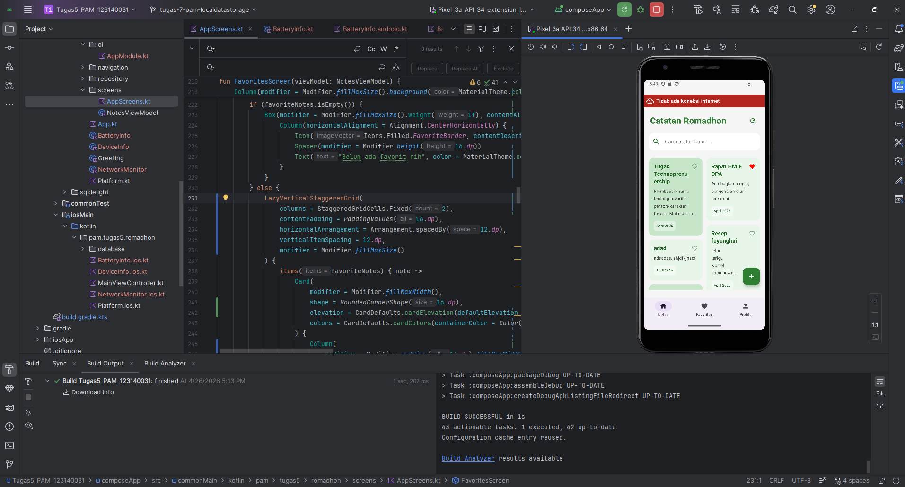
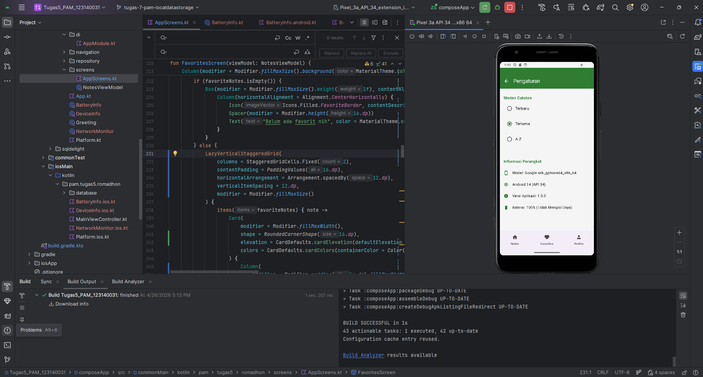

# Tugas 8: Platform-Specific Features

**Nama:** Muhammad Romadhon Santoso  
**NIM:** 123140031  
**Kelas:** Pemrograman Aplikasi Mobile RB

---

## 📌 Deskripsi Tugas
Proyek ini merupakan kelanjutan dari aplikasi catatan (Notes App) dengan mengimplementasikan fitur spesifik platform (Android/iOS) menggunakan *Kotlin Multiplatform* (KMP) dan manajemen *Dependency Injection* (DI).

### Fitur yang Diimplementasikan:
1. **Koin Dependency Injection:** Menggunakan Koin untuk mengatur *dependency* aplikasi secara terpusat (`AppModule`), sehingga inisialisasi kelas tidak lagi dilakukan secara manual di UI.
2. **Device Info (expect/actual):** Menampilkan informasi spesifik perangkat (Model, Versi OS, Versi Aplikasi) di halaman Pengaturan.
3. **Network Monitor (expect/actual):** Mendeteksi koneksi internet secara *real-time* dan menampilkan *banner* peringatan jika perangkat dalam keadaan *offline*.
4. **UI Revamp (Staggered Grid):** Mengubah tampilan daftar catatan menjadi *masonry grid* yang lebih modern dan dinamis.
5. **⭐ BONUS: Battery Info (expect/actual):** Mendeteksi dan menampilkan status persentase baterai serta status pengisian daya (*charging/discharging*) di halaman Pengaturan.

---

## 🏗️ Architecture Diagram

Aplikasi ini menggunakan arsitektur **Kotlin Multiplatform (KMP)** dengan pola **Dependency Injection (Koin)**. Berikut adalah diagram interaksi antara modul `common` dan modul platform:

```mermaid
graph TD
    subgraph commonMain
        A[App.kt / UI Screens] --> B[NotesViewModel]
        B --> C[NoteRepository]
        B --> D[koinInject: DeviceInfo]
        B --> E[koinInject: NetworkMonitor]
        B --> F[koinInject: BatteryInfo]
        G[AppModule.kt] -- Register --> D
        G -- Register --> E
        G -- Register --> F
    end

    subgraph androidMain
        D -- actual --H[Android System API]
        E -- actual --I[ConnectivityManager]
        F -- actual --J[BatteryManager]
    end

    subgraph iosMain
        D -- actual --K[iOS Foundation]
        E -- actual --L[Network Framework]
        F -- actual --M[UIDevice Battery]
    end
```
---
## 📸 Dokumentasi Tangkapan Layar (Screenshots)

*Silakan ganti path gambar di bawah ini sesuai dengan nama file screenshot yang Anda unggah ke repositori.*

### 1. Network Status Indicator
*(Menampilkan banner peringatan saat tidak ada koneksi internet)*


### 2. Device & Battery Info di Settings Screen
*(Menampilkan detail Model HP, OS, dan Status Baterai)*


---
## 🎥 Video Demonstrasi

Video di bawah ini mendemonstrasikan fungsionalitas Koin DI, deteksi jaringan secara *real-time*, pengambilan data perangkat, serta fitur bonus deteksi baterai.

▶️ **[Tonton Video Demonstrasi Tugas 8 di YouTube]([https://youtu.be/Fhy1x0eqJHI])**

