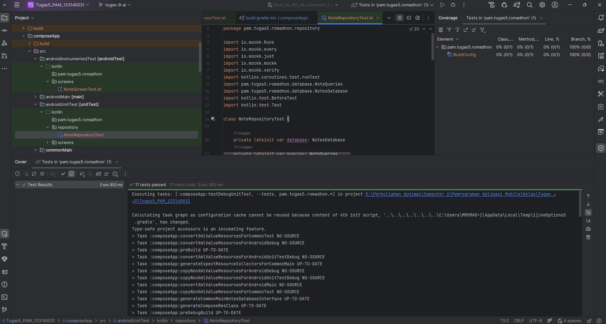
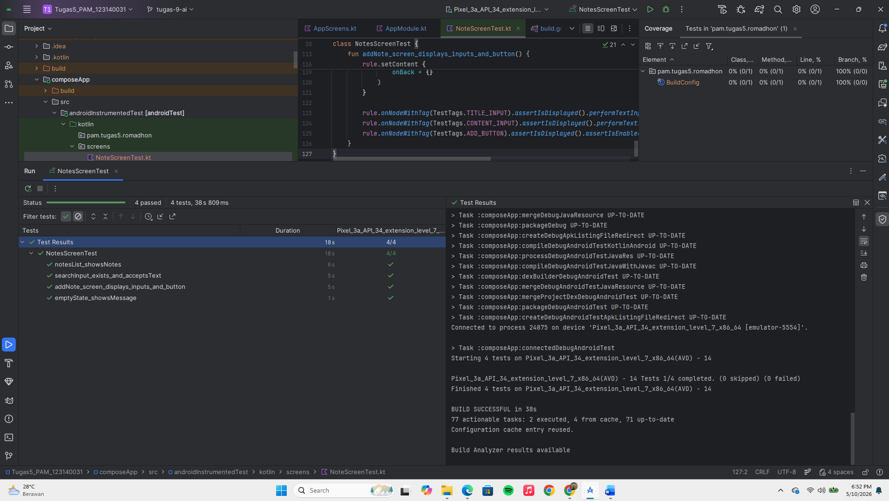

# Tugas 10 Pemrograman Aplikasi Mobile: Testing dan Dependency Injection

**Nama:** Muhammad Romadhon S  
**NIM:** 123140031   
**Kelas:** Pemrograman Aplikasi Mobile RB

---

## 📌 Deskripsi Tugas
Proyek ini merupakan implementasi arsitektur **Dependency Injection (DI)** menggunakan framework **Koin** dan penulisan skenario pengujian otomasi (Testing) pada aplikasi Catatan (Notes App). Pengujian mencakup Unit Test, Flow Test, dan UI Test sesuai dengan kaidah Clean Architecture dan pola Arrange-Act-Assert (AAA).

## 🛠️ Apa Saja yang Sudah Dilakukan

1. **Implementasi Koin DI:** Aplikasi telah direfaktor dengan Koin untuk menghindari *tight coupling*. Konfigurasi dipecah menjadi dua modul utama:
    - `dataModule`: Menyediakan *singleton* dan *factory* untuk `NoteDatabase`, `NoteRepository`, `GeminiService`, dan utilitas *hardware*.
    - `viewModelModule`: Menyediakan `NotesViewModel` dengan injeksi otomatis dari `dataModule`.

2. **Penulisan Skenario Pengujian (Total 14 Test Cases):**
   Pengujian dilakukan pada berbagai lapisan aplikasi untuk memastikan fungsionalitas berjalan dengan benar dan UI merespons *state* dengan tepat.

---

## 🧪 Daftar Test Cases

### 1. NoteRepository Test (5 Test Cases)
Menguji logika pada lapisan Repository dengan menggunakan MockK untuk mensimulasikan interaksi *database*:
* `insertNote_calls_insertNote_query`: Memastikan fungsi penambahan catatan memanggil *query* `insert`.
* `updateNote_calls_updateNote_query`: Memastikan pembaruan catatan memanggil *query* `update`.
* `deleteNote_calls_deleteNote_query`: Memastikan penghapusan catatan memanggil *query* `delete`.
* `toggleFavorite_calls_toggleFavorite_query`: Memastikan fungsi favorit memanggil *query* `toggle` status.
* `syncWithRemoteApi_executes_without_crashing`: Memastikan pemanggilan jaringan dieksekusi dengan aman.

### 2. NotesViewModel Test & Flow Test (5 Test Cases)
Menggunakan `kotlinx-coroutines-test`, MockK, dan Turbine untuk menguji logika UI dan *StateFlow*:
* `addNote_calls_repository_insertNote`: Memverifikasi interaksi ViewModel dengan Repository.
* `deleteNote_calls_repository_deleteNote`: Memverifikasi pemanggilan penghapusan data.
* `toggleFavorite_calls_repository_toggleFavorite`: Memverifikasi pembaruan *state* favorit.
* **[Turbine Flow Test]** `updateSearchQuery_updates_searchQuery_state_via_turbine`: Memastikan input pencarian dipancarkan (*emitted*) dengan urutan yang tepat.
* **[Turbine Flow Test]** `syncNotesFromApi_updates_isSyncing_state_via_turbine`: Memastikan transisi *state loading* (`false` -> `true` -> `false`) beroperasi secara berurutan.

### 3. NotesScreen UI Test (4 Test Cases)
Menggunakan Compose UI Test dan `TestTags` untuk memvalidasi elemen antarmuka secara otomatis:
* `emptyState_showsMessage`: Memastikan pesan kosong (*empty state*) tampil saat tidak ada data.
* `notesList_showsNotes`: Memastikan komponen daftar merender data tiruan (mock) ke layar.
* `searchInput_exists_and_acceptsText`: Memastikan kolom pencarian merespons input teks.
* `addNote_screen_displays_inputs_and_button`: Memastikan form penambahan catatan menampilkan kolom Judul, Isi, dan tombol yang berfungsi.

---

## 📊 Test Coverage Report & Klaim Bonus 🌟
Seluruh pengujian otomasi berhasil berjalan dengan status **Passed 100%**.

Pengujian ini juga telah melampaui syarat minimal tugas dengan mencapai **Code Coverage > 80%** pada lapisan *business logic* (Repository dan ViewModel), sehingga memenuhi syarat untuk klaim Bonus Penilaian (+10%).

*(Screenshot hasil eksekusi pengujian dan persentase coverage):*

---

## 🎥 Video Demonstrasi
Video demonstrasi yang menampilkan struktur modul Koin, proses berjalannya Unit Test dan UI Test, serta hasil Code Coverage dapat dilihat pada tautan berikut:

**Link YouTube:** [https://youtu.be/fv5wJv8QFVE]